---

## 📊 Mermaid Diagram

> ⚠️ To render the Mermaid chart, you'll need a Markdown viewer that supports it (e.g. VS Code with the Markdown Preview Mermaid plugin).

```mermaid
graph TD
    A[project-root]
    A --> B[apps]
    B --> B1[frontend]
    B1 --> B1a[public]
    B1 --> B1b[src]
    B1b --> B1b1[assets]
    B1b --> B1b2[components]
    B1b --> B1b3[hooks]
    B1b --> B1b4[pages]
    B1b --> B1b5[services]
    B1b --> B1b6[store]
    B1b --> B1b7[styles]
    B1b --> B1b8[App.tsx]
    B --> B2[api]
    B2 --> B2a[src]
    B2a --> B2a1[controllers]
    B2a --> B2a2[routes]
    B2a --> B2a3[services]
    B2a --> B2a4[models]
    B2a --> B2a5[middlewares]
    B --> B3[websocket]
    B3 --> B3a[src]
    B3a --> B3a1[handlers]
    B --> B4[llm-service]
    B4 --> B4a[src]
    B4a --> B4a1[clients]
    B4a --> B4a2[processors]

    A --> C[infra]
    C --> C1[docker]
    C1 --> C1a[api]
    C1 --> C1b[frontend]
    C1 --> C1c[websocket]
    C1 --> C1d[llm-service]
    C --> C2[k8s]
    C2 --> C2a[deployments]
    C2 --> C2b[services]
    C2 --> C2c[ingress]
    C2 --> C2d[secrets]
    C --> C3[scripts]

    A --> D[databases]
    D --> D1[mongodb]
    D --> D2[qdrant]

    A --> E[mobile]
    E --> E1[android]
    E --> E2[ios]

    A --> F[shared]
    F --> F1[types]
    F --> F2[utils]
    F --> F3[config]

    A --> G[.env]
    A --> H[docker-compose.yml]
    A --> I[package.json]
    A --> J[README.md]
    A --> K[tsconfig.json]
```

├── apps/
│ ├── frontend/
│ │ ├── public/
│ │ ├── src/
│ │ │ ├── assets/
│ │ │ ├── components/
│ │ │ ├── hooks/
│ │ │ ├── pages/
│ │ │ ├── services/
│ │ │ ├── store/
│ │ │ ├── styles/
│ │ │ └── App.tsx
│ │ ├── .env
│ │ └── vite.config.ts
│ │
│ ├── api/
│ │ ├── src/
│ │ │ ├── controllers/
│ │ │ ├── routes/
│ │ │ ├── services/
│ │ │ ├── models/
│ │ │ ├── middlewares/
│ │ │ └── index.ts
│ │ └── .env
│ │
│ ├── websocket/
│ │ ├── src/
│ │ │ └── handlers/
│ │ └── .env
│ │
│ └── llm-service/
│ ├── src/
│ │ ├── clients/
│ │ ├── processors/
│ │ └── index.ts
│ └── .env
│
├── infra/
│ ├── docker/
│ │ ├── api/
│ │ ├── frontend/
│ │ ├── websocket/
│ │ └── llm-service/
│ ├── k8s/
│ │ ├── deployments/
│ │ ├── services/
│ │ ├── ingress/
│ │ └── secrets/
│ └── scripts/
│
├── databases/
│ ├── mongodb/
│ └── qdrant/
│
├── mobile/
│ ├── android/
│ └── ios/
│
├── shared/
│ ├── types/
│ ├── utils/
│ └── config/
│
├── .env
├── docker-compose.yml
├── package.json
├── README.md
└── tsconfig.json

# Create directory structure
- mkdir -p apps/frontend/public
- mkdir -p apps/frontend/src/{assets,components,hooks,pages,services,store,styles}
- mkdir -p apps/api/src/{controllers,routes,services,models,middlewares}
- mkdir -p apps/websocket/src/handlers
- mkdir -p apps/llm-service/src/{clients,processors}
- mkdir -p infra/docker/{api,frontend,websocket,llm-service}
- mkdir -p infra/k8s/{deployments,services,ingress,secrets}
- mkdir -p infra/scripts
- mkdir -p databases/{mongodb,qdrant}
- mkdir -p mobile/{android,ios}
- mkdir -p shared/{types,utils,config}

# Create common config and entry files
touch .env docker-compose.yml package.json README.md tsconfig.json

# Frontend-specific files
touch apps/frontend/.env
touch apps/frontend/vite.config.ts
touch apps/frontend/src/App.tsx

# API-specific files
touch apps/api/.env

# WebSocket-specific files
touch apps/websocket/.env

# LLM Service-specific files
touch apps/llm-service/.env
